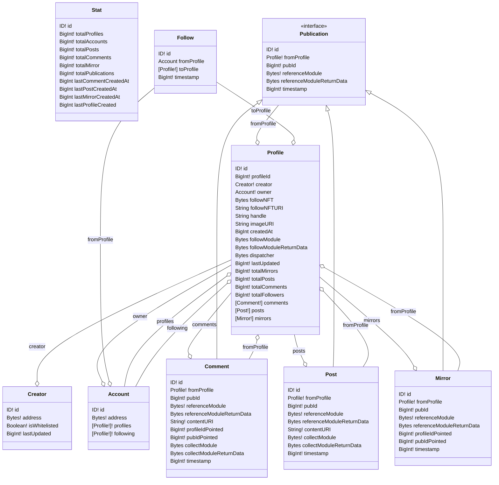

# Subgraph for Lens Protocols

-In process-

**How to deploy**

1. Clone the repository
2. Add a Subgraph in https://thegraph.com/hosted-service/
3. `yarn install` into the subgraph directory
4. `graph auth --product hosted-service <ACCESS_TOKEN>`
5. `yarn deploy`

**Link to the hosted service subgraph :**
https://thegraph.com/hosted-service/subgraph/rtomas/lens-subgraph
(there are some saved queries to play with the subgraph)

---

**Contract from the collection :**
https://polygonscan.com/address/0xDb46d1Dc155634FbC732f92E853b10B288AD5a1d

**Official Website :**
https://lens.xyz/

mermaid class diagram autogenerated with https://github.com/rtomas/mmd-GraphSchema

TODO:
keep working in the following:

- Account.following
- follower Entity
- Fill all dates in LensInfo Entity
- Unfollow a profile
- All the Modules
