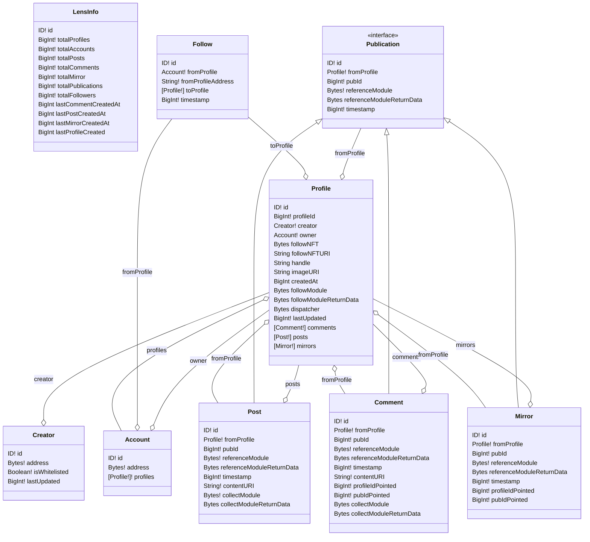

# Subgraph for Lens Protocols

-In process-

todo:

- Finish the follower
- fromProfile in Follow is not working
- Comment all the entities
- Last Dates in LensInfo
- Continue investigating about modules and how to represent them

**Link to the hosted service subgraph :**
https://thegraph.com/hosted-service/subgraph/rtomas/lens-subgraph
(there are some saved queries to play with the subgraph)

---

**Contract from the collection :**
https://polygonscan.com/address/0xDb46d1Dc155634FbC732f92E853b10B288AD5a1d

**Official Website :**
https://lens.xyz/

graph autogenerated with https://github.com/rtomas/mmd-GraphSchema
